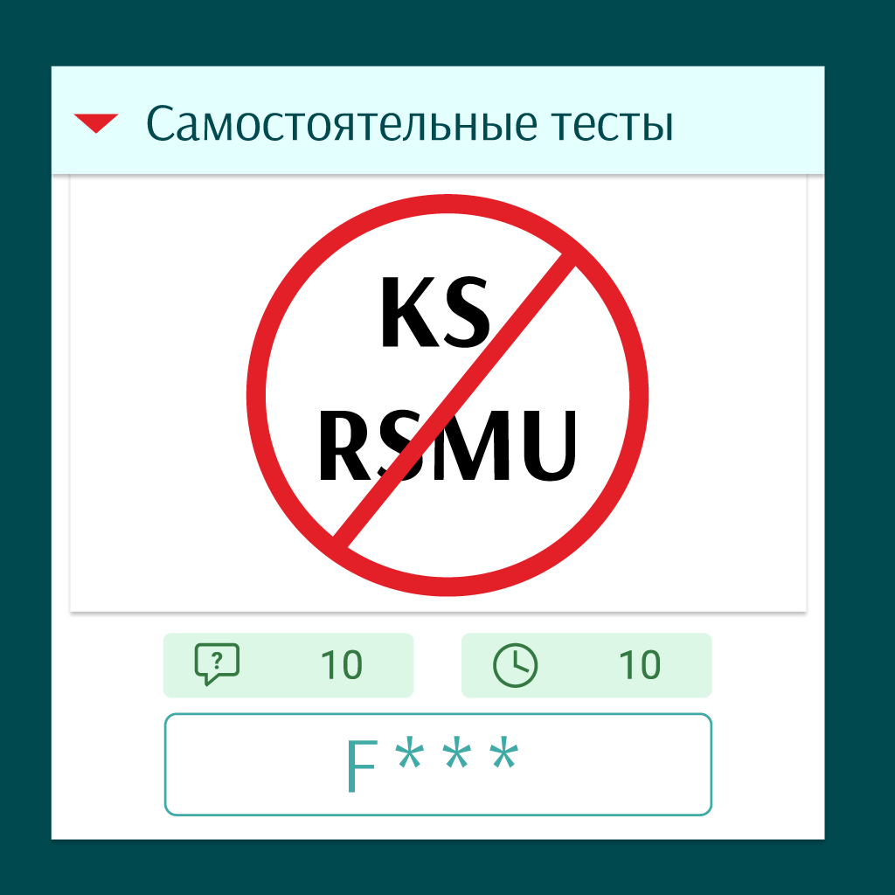

# F___ KS Tests
 

    
     
    <b><i>Chrome add-on for freedom of choice on ks2.rsmu.ru tests.</i></b>

## Features

- Works exclusively on pages in the `https://ks2.rsmu.ru/tests2/questions` domain without affecting other sites.

## Installation

1. Clone or [download](https://github.com/f-normies/F___-KS-Tests/archive/refs/heads/main.zip) this repo.
2. Open the [Extension Page](chrome://extensions/) in your Chrome browser or similar.
3. Switch on developer mode in the top right corner.
4. Drag and drop the downloaded extension folder into your browser window and confirm the installation.

## Usage

After installation, the extension is automatically activated on the `https://ks2.rsmu.ru/tests2/questions` domain pages.

## Security

This extension does not collect or transmit any data from your web pages. All code runs locally on your device.

## Contribution to the project

We welcome any contribution to the project. If you would like to suggest an improvement or report a bug, please use the [Issues](https://github.com/f-normies/F___-KS-Tests/issues) section on GitHub.

## Licence

The project is distributed under the MIT licence. See the [LICENSE](LICENSE) file for more information.